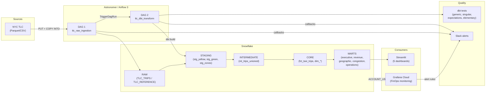
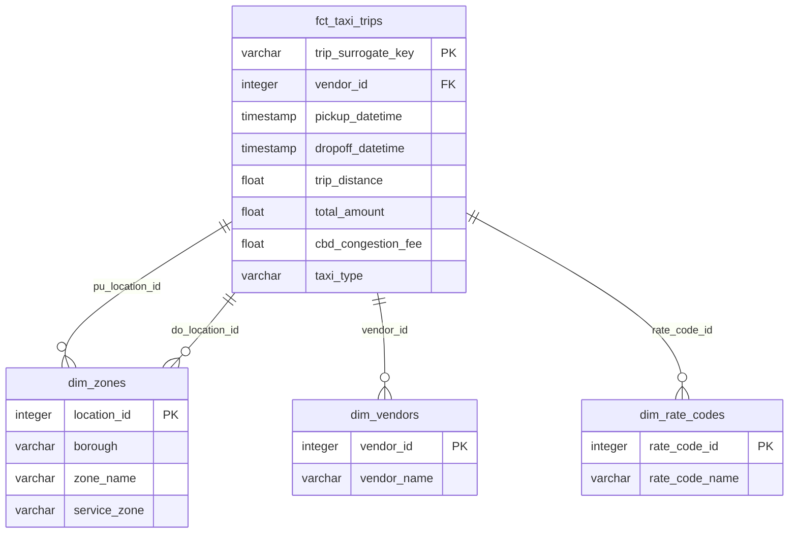

# snow-airflow-dbt

Production-grade ELT pipeline for NYC TLC taxi data analysis: **Snowflake** + **Airflow (Astronomer)** + **dbt** + **Streamlit** + **Grafana FinOps**.

---

## Architecture





---

## Project Structure

```
snow-airflow-dbt/
├── .github/
│   └── workflows/
│       └── ci.yml                     # 3-job CI: SQLFluff lint, dbt build, DAG validation
├── astro-project/                     # Astronomer project (Airflow 3, Runtime 3.1)
│   ├── Dockerfile
│   ├── requirements.txt               # dbt-snowflake, astronomer-cosmos, elementary
│   ├── airflow_settings.yaml          # Snowflake connection config
│   ├── dags/
│   │   ├── tlc_raw_ingestion.py       # DAG 1: download -> PUT -> COPY INTO
│   │   └── tlc_dbt_transform.py       # DAG 2: dbt seed -> build -> elementary
│   └── include/
│       ├── slack_alerts.py            # Slack Block Kit notifications
│       ├── sql/
│       │   ├── copy_into_yellow.sql
│       │   ├── copy_into_green.sql
│       │   └── copy_into_zone_lookup.sql
│       └── dbt_project/
│           ├── dbt_project.yml
│           ├── profiles.yml
│           ├── packages.yml           # dbt_utils, dbt_expectations, elementary, evaluator
│           ├── seeds/                 # rate_codes, payment_types, vendor_lookup
│           ├── snapshots/             # SCD2 on taxi_zone_lookup
│           ├── tests/
│           │   ├── generic/           # test_positive_value
│           │   └── singular/          # assert_no_future_trips, assert_fare_consistent_with_distance
│           └── models/
│               ├── staging/           # 3 models (incremental, delete+insert)
│               ├── intermediate/      # 1 model (ephemeral union)
│               └── marts/
│                   ├── core/          # fct_taxi_trips (incremental), dim_zones, dim_vendors, dim_rate_codes
│                   ├── executive/     # met_executive_summary
│                   ├── revenue/       # 4 models (daily, zone, rate_code, payment)
│                   ├── geographic/    # 4 models (zone ranking, pairs, borough, airport)
│                   ├── congestion/    # 4 models (CBD impact, CBD vs non-CBD, peak, yellow vs green)
│                   └── operations/    # 4 models (hourly demand, duration, speed, vendor)
├── grafana/
│   ├── datasource.json               # Snowflake datasource (ACCOUNT_USAGE)
│   ├── finops-dashboard.json          # 6-panel FinOps dashboard
│   ├── alert-rules.json               # 5 alert rules (credit burn, budget, queries, warehouse)
│   └── deploy.sh                      # Automated provisioning script
├── streamlit_app/
│   ├── app.py                         # Multi-page entry point (st.navigation)
│   ├── requirements.txt
│   ├── utils/snowflake_conn.py        # Cached Snowflake connection
│   ├── .streamlit/config.toml         # Dark theme config
│   └── pages/
│       ├── 1_Executive_Overview.py
│       ├── 2_Revenue_Analysis.py
│       ├── 3_Geographic_Intel.py
│       ├── 4_Congestion_Pricing.py
│       └── 5_Operations.py
├── spec.md                            # Full project specification (11 sections)
└── CHANGELOG.md
```

**25 dbt models** | **3 seeds** | **1 snapshot** | **5 Streamlit pages** | **6 Grafana panels** | **5 alert rules**

---

## Tech Stack

| Layer | Technology | Version |
|---|---|---|
| **Cloud DWH** | Snowflake | Enterprise (AWS) |
| **Orchestration** | Apache Airflow | 3.0.1 (Astro Runtime 3.1) |
| **Transformation** | dbt-core / dbt-snowflake | 1.11.x |
| **Data Quality** | dbt_expectations, Elementary | 0.10.x / 0.23.x |
| **CI/CD** | GitHub Actions | SQLFluff + dbt build + DAG validation |
| **Visualization** | Streamlit + Plotly | 1.41+ / 5.24+ |
| **FinOps Monitoring** | Grafana Cloud | 13.0.0 (Enterprise) |
| **Alerting** | Slack (Block Kit) | Webhook integration |

---

## Prerequisites

- **Docker Desktop** (running)
- **Astro CLI** >= 1.40 (`brew install astro`)
- **Snowflake account** with `ACCOUNTADMIN` role
- **Python** >= 3.11
- **Grafana Cloud** instance with Snowflake plugin installed

---

## Setup

### 1. Clone the repository

```bash
git clone https://github.com/Stefen-Taime/snow-airflow-dbt.git
cd snow-airflow-dbt
```

### 2. Snowflake setup

Connect to your Snowflake account and run the SQL commands from `spec.md` Section 3 to create:
- Databases: `RAW`, `ANALYTICS`
- Schemas: `RAW.TLC_TRIPS`, `RAW.TLC_REFERENCE`
- Warehouse: `TLC_WH` (X-SMALL, auto-suspend 60s)
- Tables, stages, and file formats
- Resource monitor: `tlc_budget_monitor` (100 credits/month)

### 3. Astronomer / Airflow

```bash
cd astro-project

# Configure Snowflake connection in airflow_settings.yaml
# Set SNOWFLAKE_ACCOUNT, SNOWFLAKE_USER, SNOWFLAKE_PASSWORD, etc.

# Start Airflow (5 containers)
astro dev start

# Airflow UI: http://localhost:8080
```

Configure Airflow variables:
- `tlc_base_url`: `https://d37ci6vzurychx.cloudfront.net/trip-data`
- `tlc_data_months`: `["2026-01"]`
- `slack_webhook_url`: your Slack incoming webhook URL

### 4. Run the pipeline

1. Trigger **DAG 1** (`tlc_raw_ingestion`) from the Airflow UI
   - Downloads TLC Parquet/CSV files
   - PUT to Snowflake internal stages
   - COPY INTO raw tables
   - Auto-triggers DAG 2
2. **DAG 2** (`tlc_dbt_transform`) runs automatically:
   - `dbt seed` (reference tables)
   - `dbt build` (staging -> intermediate -> core -> marts)
   - Elementary observability report

### 5. Streamlit dashboards

```bash
cd streamlit_app

# Configure .streamlit/secrets.toml with your Snowflake credentials
pip install -r requirements.txt
streamlit run app.py
# Open http://localhost:8501
```

5 interactive pages: Executive Overview, Revenue Analysis, Geographic Intel, Congestion Pricing, Operations.

### 6. Grafana FinOps monitoring

```bash
cd grafana

export GRAFANA_URL="https://your-instance.grafana.net"
export GRAFANA_TOKEN="glsa_xxxx..."
export SNOWFLAKE_PASSWORD="your_password"

# Install Snowflake plugin first (Connections > Add new connection > Snowflake)
./deploy.sh
```

Deploys:
- Snowflake datasource (ACCOUNT_USAGE views)
- 6-panel FinOps dashboard (credits, budget, warehouses, queries, storage)
- 5 alert rules (credit burn rate, budget thresholds, long queries, idle warehouses)

---

## dbt Models

### Lineage

```
Sources (RAW)
  ├── stg_yellow_taxi_trips  (incremental, delete+insert)
  ├── stg_green_taxi_trips   (incremental, delete+insert)
  └── stg_taxi_zone_lookup   (table)
        │
        v
  int_trips_unioned (ephemeral)
        │
        v
  fct_taxi_trips (incremental, delete+insert, contract enforced)
  dim_zones / dim_vendors / dim_rate_codes (table)
        │
        v
  ┌─────────────┬──────────────┬──────────────┬──────────────┬──────────────┐
  │  executive   │   revenue    │  geographic  │  congestion  │  operations  │
  │  (1 model)   │  (4 models)  │  (4 models)  │  (4 models)  │  (4 models)  │
  └─────────────┴──────────────┴──────────────┴──────────────┴──────────────┘
```

### Data Quality

| Test Type | Count | Details |
|---|---|---|
| **Column tests** | unique, not_null, accepted_values, relationships | Core models fully tested |
| **dbt_expectations** | 3 | Range checks on passenger_count, trip_distance, fare_amount |
| **Elementary** | 2 | volume_anomalies, schema_changes on fct_taxi_trips |
| **Generic** | 1 | test_positive_value (reusable) |
| **Singular** | 2 | assert_no_future_trips, assert_fare_consistent_with_distance |
| **Mart tests** | Column-level | not_null, positive values, accepted_values across all 17 mart models |

---

## CI/CD Pipeline

GitHub Actions workflow (`.github/workflows/ci.yml`) runs on PRs to `main`:

```
┌────────────────┐    ┌──────────────────────┐    ┌───────────────────┐
│  SQLFluff Lint  │───>│  dbt Build & Test    │    │  DAG Validation   │
│  (models/)      │    │  (state:modified+)   │    │  (Python import)  │
└────────────────┘    │  + project_evaluator  │    └───────────────────┘
                      └──────────────────────┘
                                │ failure
                                v
                      ┌──────────────────────┐
                      │  Slack Notification   │
                      └──────────────────────┘
```

---

## Alerting

### Airflow (Slack Block Kit)
- DAG success/failure callbacks with color-coded messages
- Task-level failure notifications with error details
- Channel: configurable via `slack_channel` Airflow variable

### Grafana (Alert Rules)
| Rule | Threshold | Severity |
|---|---|---|
| High Credit Burn Rate | > 20 credits/day | warning |
| Budget 50% Reached | > $200 cumulative | warning |
| Budget 80% Reached | > $320 cumulative | critical |
| Long Running Query | > 5 min execution | warning |
| Warehouse Auto-Suspend | > 10% cloud services ratio | info |

---

## Visualizations

### Grafana FinOps Monitoring

#### Credit Burn Rate & Budget Tracking


Main FinOps monitoring dashboard on Grafana Cloud. This view provides a comprehensive overview of Snowflake consumption over the last 30 days:

- **Credit Burn Rate (Daily)**: combined chart showing daily credits consumed (bars) and estimated cost in dollars (red line). The daily average is 1.23 credits for a total of 23.4 credits over the period, with an estimated cost of $81.80.
- **Cumulative Credit Consumption vs Budget**: tracks cumulative consumption (orange line) against the allocated budget of 100 credits (dashed red line). Helps anticipate budget overruns before they occur.
- **Credits by Warehouse (Last 30d)**: donut chart showing credit distribution by warehouse. Quickly identifies the most resource-intensive warehouses (COMPUTE_WH, ANALYTICS_WH, TLC_WH, etc.).
- **Top 10 Most Expensive Queries (Last 7d)**: table listing the costliest queries with execution duration, data scanned, and cloud credits consumed.

#### Storage & Warehouse Breakdown


Additional FinOps dashboard panels:

- **Storage Usage Trend (Last 30d)**: Snowflake storage evolution broken down into three categories: Database (210 MB), Stage (0 GB), and Fail-safe (3.19 GB). Storage growth is visible starting mid-March with the TLC data ingestion.
- **Warehouse Credit Breakdown**: detailed credit breakdown per warehouse, separating compute credits, cloud services credits, and the cloud services percentage. Useful for detecting warehouses with an abnormally high cloud services ratio (alert threshold > 10%).

---

### Streamlit Dashboards

#### Revenue Analysis


Revenue analysis page of the Streamlit dashboard. The top KPI bar displays key metrics:

- **Total Revenue**: $109.6M generated over the analyzed period
- **Total Trips**: 3.76M rides
- **Avg Rev / Trip**: $26.70 average revenue per trip
- **Total Tips**: $9.8M in tips
- **Avg Tip %**: 14.0% average tip rate
- **Rev / Mile**: $5.99 revenue per mile

The **Daily Revenue Trend** chart shows daily revenue (orange line) overlaid with trip count (dashed green line). A strong correlation between trip volume and revenue is visible, with a notable dip in late January (likely related to winter weather conditions).

#### Revenue Breakdown, Zones & Rate Codes


Detailed revenue decomposition:

- **Revenue Component Breakdown (Daily)**: stacked area chart showing daily revenue composition (Fares, Tips, Tolls, Congestion Surcharge, Airport Fees, CBD Fees). Base fares represent the vast majority of revenue.
- **Top 15 Zones by Revenue**: zones ranked by total revenue. JFK Airport leads with $11M, followed by LaGuardia Airport ($5.6M) and Midtown Center ($3.9M). Airport zones and Manhattan concentrate most of the revenue.
- **Revenue by Rate Code**: breakdown by rate type. Standard rate accounts for the vast majority of revenue (>80%), followed by JFK rate (10.5%), negotiated fares (3.8%), and out-of-area destinations (Newark, Nassau/Westchester).

#### Geographic Intelligence - Pickup Zones


Geographic intelligence page with key KPIs: 259 active zones, 6 boroughs covered, Upper East Side South as the busiest zone, and 281,581 airport trips.

The **Top 20 Pickup Zones** chart ranks pickup locations by trip volume. Upper East Side South (160K), Upper East Side North (154K), and JFK Airport (153K) form the top 3. Manhattan zones dominate heavily, with a color scale ranging from red (high volume) to blue (lower volume).

#### Geographic Intelligence - Boroughs & Route Corridors


Advanced geographic analytics:

- **Borough Trip Volume Trend**: trip volume evolution by borough over time. Manhattan dominates massively with over 3M trips, far ahead of Queens and other boroughs.
- **Avg Revenue per Trip by Borough**: average revenue per trip by borough. EWR (Newark Airport) shows the highest revenue at $127.49/trip, followed by Staten Island ($42.66) and Queens ($41.23). Manhattan, despite its volume, has a lower average revenue ($23.80) due to shorter trip distances.
- **Top 15 Route Corridors (Pickup -> Dropoff)**: the most frequently traveled corridors. Upper East Side South <-> Upper East Side North routes dominate, typical of local commuting within Manhattan's affluent residential neighborhoods.

#### Geographic Intelligence - Airport Analysis


Airport-specific traffic analysis:

- **Airport Trip Analysis (Sunburst)**: sunburst chart showing the pickup/dropoff split for JFK and LaGuardia. JFK generates significantly higher total revenue (>$10M) compared to LaGuardia, with a balanced distribution between pickups and dropoffs.
- **Airport Trips Timeline**: cumulative airport trip evolution over time. JFK (orange) represents roughly double the volume of LaGuardia (turquoise), with linear growth over the period.

#### Congestion Pricing Impact


Analysis of the congestion pricing impact (CBD - Central Business District):

- **KPIs**: $1.9M in CBD fees collected, 37.9% of trips passing through the CBD, average fee of $0.75/trip, average speed of 14.3 mph in the CBD, 2.6M CBD trips, and $5.99 revenue per mile.
- **CBD Trip Volume & Fee Collection (Daily)**: combined chart showing daily CBD trip volume (orange bars) and fees collected (turquoise line). Volume oscillates between 60K and 100K trips/day with a stable trend, indicating that congestion pricing has not significantly reduced traffic.

#### Congestion - CBD vs Non-CBD Comparison


Direct comparison between CBD and non-CBD zones:

- **Avg Revenue / Trip: CBD vs Non-CBD**: CBD trips generate lower average revenue per trip compared to non-CBD trips for yellow taxis ($63 vs $29), but similar for green taxis. This is explained by shorter distances within the CBD.
- **Avg Speed: CBD vs Non-CBD (mph)**: average speed in the CBD is significantly lower than outside the CBD, particularly pronounced for green taxis. Yellow taxis maintain relatively low speeds in both zones due to Manhattan's traffic density.

#### Congestion - Yellow vs Green CBD Penetration


CBD penetration analysis by taxi type:

- **CBD Trips by Taxi Type**: yellow taxis account for approximately 70% of CBD trips (yellow line stable around 70-80%), while green taxis remain marginal (<10%). This reflects regulations that restrict green taxis primarily to outer boroughs.
- **CBD Fee Revenue by Taxi Type**: the vast majority of CBD fees ($1.9M) come from yellow taxis, with green taxis contributing only a negligible fraction.

#### Operations Dashboard


Operations page with key KPIs: 3.69M trips, 47.0 mph average speed, 18.6 min average duration, 3 active vendors, peak hour at 18:00, and 11.9 miles average distance.

The **Hourly Demand Heatmap** is a heatmap visualization crossing days of the week (Y-axis) with hours of the day (X-axis). Warm colors (yellow/orange) indicate high demand. Key patterns:

- Peak demand in the evening (5PM-10PM), particularly on Thursdays and Fridays
- Sustained demand on Saturday late night (12AM-4AM), typical of nightlife activity
- Demand trough on weekdays between 4AM and 7AM
- Sunday as the quietest day overall

#### Operations - Trip Duration Distribution


Trip duration distribution analysis:

- **Trip Duration Distribution**: histogram showing trip distribution by duration bucket. The 10-20 min bucket dominates with 1.4M trips, followed by 5-10 min (900K) and 20-30 min (600K). Trips over 60 min are rare (<100K). Yellow taxis vastly outnumber green taxis across all duration buckets.
- **Avg Fare & Distance by Duration**: correlation between duration, average fare (orange bars), and average distance (turquoise line). Fare increases from $20 (0-5 min) to $105 (60+ min), while distance goes from 2 miles to 24 miles. The near-linear relationship confirms the consistency of the fare model.

---

## License

Private project.
