# snow-airflow-dbt

Production-grade ELT pipeline for NYC TLC taxi data analysis: **Snowflake** + **Airflow (Astronomer)** + **dbt** + **Streamlit** + **Grafana FinOps**.

---

## Architecture

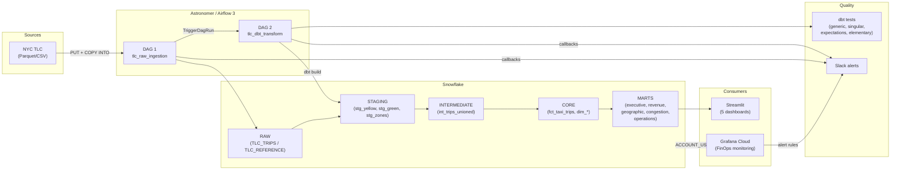

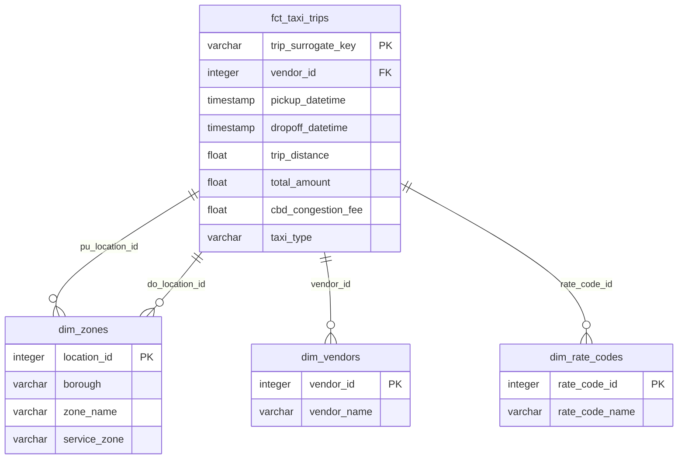

---

## Project Structure

```
snow-airflow-dbt/
├── .github/
│   └── workflows/
│       └── ci.yml                     # 3-job CI: SQLFluff lint, dbt build, DAG validation
├── astro-project/                     # Astronomer project (Airflow 3, Runtime 3.1)
│   ├── Dockerfile
│   ├── requirements.txt               # dbt-snowflake, astronomer-cosmos, elementary
│   ├── airflow_settings.yaml          # Snowflake connection config
│   ├── dags/
│   │   ├── tlc_raw_ingestion.py       # DAG 1: download -> PUT -> COPY INTO
│   │   └── tlc_dbt_transform.py       # DAG 2: dbt seed -> build -> elementary
│   └── include/
│       ├── slack_alerts.py            # Slack Block Kit notifications
│       ├── sql/
│       │   ├── copy_into_yellow.sql
│       │   ├── copy_into_green.sql
│       │   └── copy_into_zone_lookup.sql
│       └── dbt_project/
│           ├── dbt_project.yml
│           ├── profiles.yml
│           ├── packages.yml           # dbt_utils, dbt_expectations, elementary, evaluator
│           ├── seeds/                 # rate_codes, payment_types, vendor_lookup
│           ├── snapshots/             # SCD2 on taxi_zone_lookup
│           ├── tests/
│           │   ├── generic/           # test_positive_value
│           │   └── singular/          # assert_no_future_trips, assert_fare_consistent_with_distance
│           └── models/
│               ├── staging/           # 3 models (incremental, delete+insert)
│               ├── intermediate/      # 1 model (ephemeral union)
│               └── marts/
│                   ├── core/          # fct_taxi_trips (incremental), dim_zones, dim_vendors, dim_rate_codes
│                   ├── executive/     # met_executive_summary
│                   ├── revenue/       # 4 models (daily, zone, rate_code, payment)
│                   ├── geographic/    # 4 models (zone ranking, pairs, borough, airport)
│                   ├── congestion/    # 4 models (CBD impact, CBD vs non-CBD, peak, yellow vs green)
│                   └── operations/    # 4 models (hourly demand, duration, speed, vendor)
├── grafana/
│   ├── datasource.json               # Snowflake datasource (ACCOUNT_USAGE)
│   ├── finops-dashboard.json          # 6-panel FinOps dashboard
│   ├── alert-rules.json               # 5 alert rules (credit burn, budget, queries, warehouse)
│   └── deploy.sh                      # Automated provisioning script
├── streamlit_app/
│   ├── app.py                         # Multi-page entry point (st.navigation)
│   ├── requirements.txt
│   ├── utils/snowflake_conn.py        # Cached Snowflake connection
│   ├── .streamlit/config.toml         # Dark theme config
│   └── pages/
│       ├── 1_Executive_Overview.py
│       ├── 2_Revenue_Analysis.py
│       ├── 3_Geographic_Intel.py
│       ├── 4_Congestion_Pricing.py
│       └── 5_Operations.py
├── spec.md                            # Full project specification (11 sections)
└── CHANGELOG.md
```

**25 dbt models** | **3 seeds** | **1 snapshot** | **5 Streamlit pages** | **6 Grafana panels** | **5 alert rules**

---

## Tech Stack

| Layer | Technology | Version |
|---|---|---|
| **Cloud DWH** | Snowflake | Enterprise (AWS) |
| **Orchestration** | Apache Airflow | 3.0.1 (Astro Runtime 3.1) |
| **Transformation** | dbt-core / dbt-snowflake | 1.11.x |
| **Data Quality** | dbt_expectations, Elementary | 0.10.x / 0.23.x |
| **CI/CD** | GitHub Actions | SQLFluff + dbt build + DAG validation |
| **Visualization** | Streamlit + Plotly | 1.41+ / 5.24+ |
| **FinOps Monitoring** | Grafana Cloud | 13.0.0 (Enterprise) |
| **Alerting** | Slack (Block Kit) | Webhook integration |

---

## Prerequisites

- **Docker Desktop** (running)
- **Astro CLI** >= 1.40 (`brew install astro`)
- **Snowflake account** with `ACCOUNTADMIN` role
- **Python** >= 3.11
- **Grafana Cloud** instance with Snowflake plugin installed

---

## Setup

### 1. Clone the repository

```bash
git clone https://github.com/Stefen-Taime/snow-airflow-dbt.git
cd snow-airflow-dbt
```

### 2. Snowflake setup

Connect to your Snowflake account and run the SQL commands from `spec.md` Section 3 to create:
- Databases: `RAW`, `ANALYTICS`
- Schemas: `RAW.TLC_TRIPS`, `RAW.TLC_REFERENCE`
- Warehouse: `TLC_WH` (X-SMALL, auto-suspend 60s)
- Tables, stages, and file formats
- Resource monitor: `tlc_budget_monitor` (100 credits/month)

### 3. Astronomer / Airflow

```bash
cd astro-project

# Configure Snowflake connection in airflow_settings.yaml
# Set SNOWFLAKE_ACCOUNT, SNOWFLAKE_USER, SNOWFLAKE_PASSWORD, etc.

# Start Airflow (5 containers)
astro dev start

# Airflow UI: http://localhost:8080
```

Configure Airflow variables:
- `tlc_base_url`: `https://d37ci6vzurychx.cloudfront.net/trip-data`
- `tlc_data_months`: `["2026-01"]`
- `slack_webhook_url`: your Slack incoming webhook URL

### 4. Run the pipeline

1. Trigger **DAG 1** (`tlc_raw_ingestion`) from the Airflow UI
   - Downloads TLC Parquet/CSV files
   - PUT to Snowflake internal stages
   - COPY INTO raw tables
   - Auto-triggers DAG 2
2. **DAG 2** (`tlc_dbt_transform`) runs automatically:
   - `dbt seed` (reference tables)
   - `dbt build` (staging -> intermediate -> core -> marts)
   - Elementary observability report

### 5. Streamlit dashboards

```bash
cd streamlit_app

# Configure .streamlit/secrets.toml with your Snowflake credentials
pip install -r requirements.txt
streamlit run app.py
# Open http://localhost:8501
```

5 interactive pages: Executive Overview, Revenue Analysis, Geographic Intel, Congestion Pricing, Operations.

### 6. Grafana FinOps monitoring

```bash
cd grafana

export GRAFANA_URL="https://your-instance.grafana.net"
export GRAFANA_TOKEN="glsa_xxxx..."
export SNOWFLAKE_PASSWORD="your_password"

# Install Snowflake plugin first (Connections > Add new connection > Snowflake)
./deploy.sh
```

Deploys:
- Snowflake datasource (ACCOUNT_USAGE views)
- 6-panel FinOps dashboard (credits, budget, warehouses, queries, storage)
- 5 alert rules (credit burn rate, budget thresholds, long queries, idle warehouses)

---

## dbt Models

### Lineage

```
Sources (RAW)
  ├── stg_yellow_taxi_trips  (incremental, delete+insert)
  ├── stg_green_taxi_trips   (incremental, delete+insert)
  └── stg_taxi_zone_lookup   (table)
        │
        v
  int_trips_unioned (ephemeral)
        │
        v
  fct_taxi_trips (incremental, delete+insert, contract enforced)
  dim_zones / dim_vendors / dim_rate_codes (table)
        │
        v
  ┌─────────────┬──────────────┬──────────────┬──────────────┬──────────────┐
  │  executive   │   revenue    │  geographic  │  congestion  │  operations  │
  │  (1 model)   │  (4 models)  │  (4 models)  │  (4 models)  │  (4 models)  │
  └─────────────┴──────────────┴──────────────┴──────────────┴──────────────┘
```

### Data Quality

| Test Type | Count | Details |
|---|---|---|
| **Column tests** | unique, not_null, accepted_values, relationships | Core models fully tested |
| **dbt_expectations** | 3 | Range checks on passenger_count, trip_distance, fare_amount |
| **Elementary** | 2 | volume_anomalies, schema_changes on fct_taxi_trips |
| **Generic** | 1 | test_positive_value (reusable) |
| **Singular** | 2 | assert_no_future_trips, assert_fare_consistent_with_distance |
| **Mart tests** | Column-level | not_null, positive values, accepted_values across all 17 mart models |

---

## CI/CD Pipeline

GitHub Actions workflow (`.github/workflows/ci.yml`) runs on PRs to `main`:

```
┌────────────────┐    ┌──────────────────────┐    ┌───────────────────┐
│  SQLFluff Lint  │───>│  dbt Build & Test    │    │  DAG Validation   │
│  (models/)      │    │  (state:modified+)   │    │  (Python import)  │
└────────────────┘    │  + project_evaluator  │    └───────────────────┘
                      └──────────────────────┘
                                │ failure
                                v
                      ┌──────────────────────┐
                      │  Slack Notification   │
                      └──────────────────────┘
```

---

## Alerting

### Airflow (Slack Block Kit)
- DAG success/failure callbacks with color-coded messages
- Task-level failure notifications with error details
- Channel: configurable via `slack_channel` Airflow variable

### Grafana (Alert Rules)
| Rule | Threshold | Severity |
|---|---|---|
| High Credit Burn Rate | > 20 credits/day | warning |
| Budget 50% Reached | > $200 cumulative | warning |
| Budget 80% Reached | > $320 cumulative | critical |
| Long Running Query | > 5 min execution | warning |
| Warehouse Auto-Suspend | > 10% cloud services ratio | info |

---

## Visualizations

### Grafana FinOps Monitoring

#### Credit Burn Rate & Budget Tracking

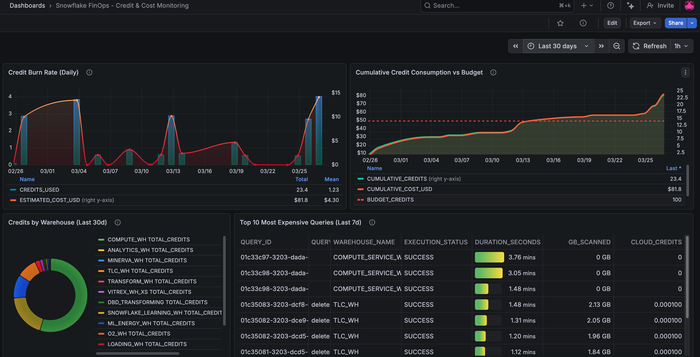

Dashboard principal de suivi FinOps sur Grafana Cloud. Ce panneau offre une vue d'ensemble de la consommation Snowflake sur les 30 derniers jours :

- **Credit Burn Rate (Daily)** : graphique combinant le nombre de credits consommes par jour (barres) et le cout estime en dollars (ligne rouge). La moyenne journaliere est de 1.23 credit pour un total de 23.4 credits sur la periode, soit un cout estime de $81.80.
- **Cumulative Credit Consumption vs Budget** : suivi de la consommation cumulee (ligne orange) comparee au budget alloue de 100 credits (ligne rouge pointillee). Permet d'anticiper les depassements budgetaires avant qu'ils ne surviennent.
- **Credits by Warehouse (Last 30d)** : repartition des credits par warehouse sous forme de donut chart. Permet d'identifier les warehouses les plus consommateurs (COMPUTE_WH, ANALYTICS_WH, TLC_WH, etc.).
- **Top 10 Most Expensive Queries (Last 7d)** : tableau listant les requetes les plus couteuses avec leur duree d'execution, le volume de donnees scannees et les credits cloud consommes.

#### Storage & Warehouse Breakdown

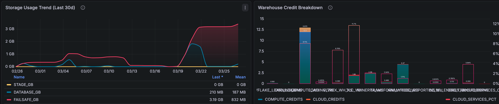

Panneaux complementaires du dashboard FinOps :

- **Storage Usage Trend (Last 30d)** : evolution du stockage Snowflake reparti en trois categories : Database (210 MB), Stage (0 GB) et Fail-safe (3.19 GB). La croissance du stockage est visible a partir de mi-mars avec l'ingestion des donnees TLC.
- **Warehouse Credit Breakdown** : decomposition detaillee des credits par warehouse, separant les credits de calcul (compute), les credits cloud services et le pourcentage de cloud services. Utile pour detecter les warehouses avec un ratio cloud services anormalement eleve (seuil d'alerte > 10%).

---

### Streamlit Dashboards

#### Revenue Analysis

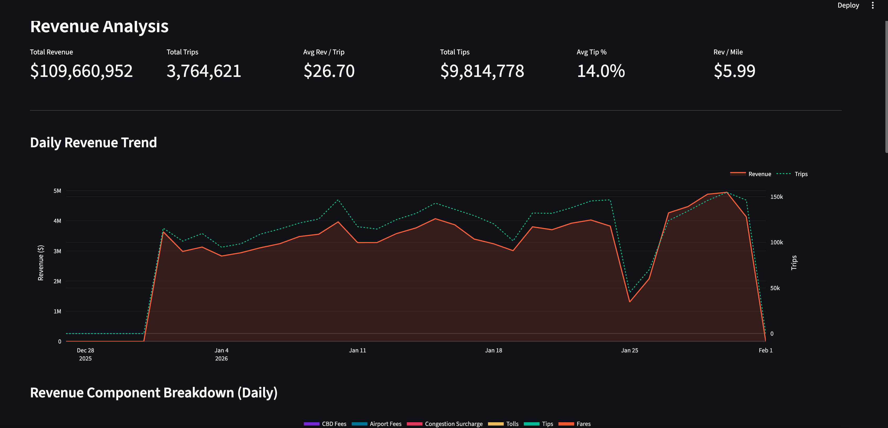

Page d'analyse des revenus du dashboard Streamlit. La barre de KPIs en haut affiche les metriques cles :

- **Total Revenue** : $109.6M generes sur la periode analysee
- **Total Trips** : 3.76M de courses
- **Avg Rev / Trip** : $26.70 de revenu moyen par course
- **Total Tips** : $9.8M de pourboires
- **Avg Tip %** : 14.0% de taux de pourboire moyen
- **Rev / Mile** : $5.99 de revenu par mile

Le graphique **Daily Revenue Trend** montre l'evolution quotidienne du revenu (ligne orange) superposee au nombre de courses (ligne verte pointillee). On observe une forte correlation entre volume de courses et revenu, avec une baisse notable fin janvier (probablement liee aux conditions meteorologiques hivernales).

#### Revenue Breakdown, Zones & Rate Codes

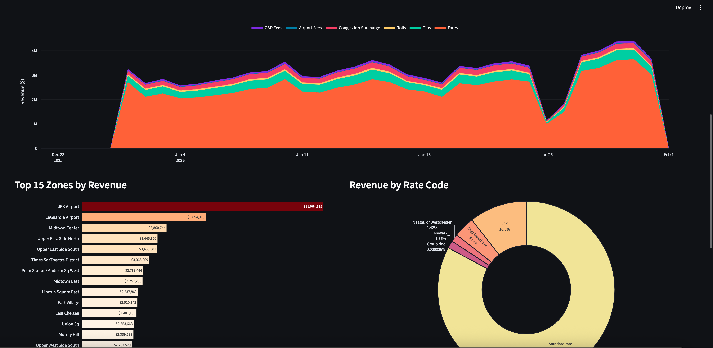

Decomposition detaillee des revenus :

- **Revenue Component Breakdown (Daily)** : graphique en aires empilees montrant la composition du revenu quotidien (Fares, Tips, Tolls, Congestion Surcharge, Airport Fees, CBD Fees). Les tarifs de base (Fares) representent la grande majorite du revenu.
- **Top 15 Zones by Revenue** : classement des zones par revenu total. JFK Airport domine avec $11M, suivi de LaGuardia Airport ($5.6M) et Midtown Center ($3.9M). Les zones aeroportuaires et de Manhattan concentrent l'essentiel des revenus.
- **Revenue by Rate Code** : repartition par type de tarification. Le tarif standard represente la quasi-totalite des revenus (>80%), suivi du tarif JFK (10.5%), des tarifs negocies (3.8%) et des destinations hors zone (Newark, Nassau/Westchester).

#### Geographic Intelligence - Pickup Zones

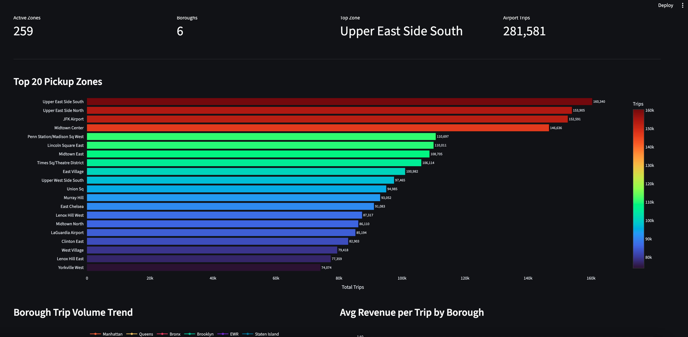

Page d'intelligence geographique avec les KPIs cles : 259 zones actives, 6 boroughs couverts, Upper East Side South comme zone la plus active, et 281,581 courses aeroportuaires.

Le graphique **Top 20 Pickup Zones** classe les zones de prise en charge par volume de courses. Upper East Side South (160K), Upper East Side North (154K) et JFK Airport (153K) forment le top 3. Les zones de Manhattan dominent largement, avec une echelle de couleurs allant du rouge (volume eleve) au bleu (volume plus faible).

#### Geographic Intelligence - Boroughs & Route Corridors

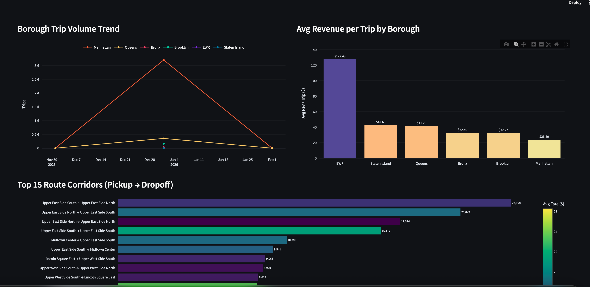

Analyses geographiques avancees :

- **Borough Trip Volume Trend** : evolution du volume de courses par borough au fil du temps. Manhattan domine massivement avec plus de 3M de courses, loin devant Queens et les autres boroughs.
- **Avg Revenue per Trip by Borough** : revenu moyen par course par borough. EWR (Newark Airport) affiche le revenu le plus eleve a $127.49/course, suivi de Staten Island ($42.66) et Queens ($41.23). Manhattan, malgre son volume, a un revenu moyen plus faible ($23.80) du fait de courses plus courtes.
- **Top 15 Route Corridors (Pickup -> Dropoff)** : les corridors les plus frequentes. Les trajets Upper East Side South <-> Upper East Side North dominent, typiques des deplacements locaux dans les quartiers residentiels aises de Manhattan.

#### Geographic Intelligence - Airport Analysis

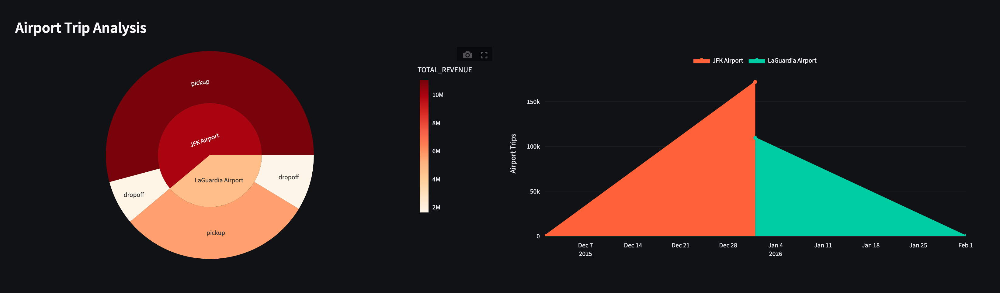

Analyse specifique du trafic aeroportuaire :

- **Airport Trip Analysis (Sunburst)** : graphique sunburst montrant la repartition pickup/dropoff pour JFK et LaGuardia. JFK genere un revenu total nettement superieur (>$10M) par rapport a LaGuardia, avec une repartition equilibree entre prises en charge et depositions.
- **Airport Trips Timeline** : evolution cumulee des courses aeroportuaires. JFK (orange) represente environ le double du volume de LaGuardia (turquoise), avec une croissance lineaire sur la periode.

#### Congestion Pricing Impact

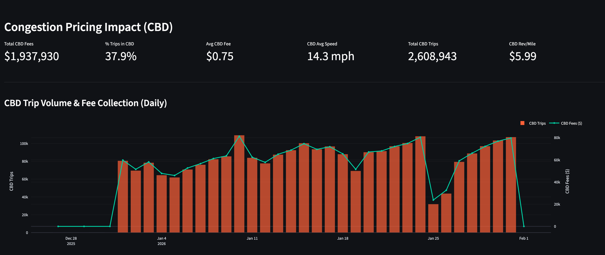

Analyse de l'impact du peage de congestion (CBD - Central Business District) :

- **KPIs** : $1.9M de frais CBD collectes, 37.9% des courses passant par le CBD, frais moyen de $0.75/course, vitesse moyenne de 14.3 mph dans le CBD, 2.6M de courses CBD, et $5.99 de revenu par mile.
- **CBD Trip Volume & Fee Collection (Daily)** : graphique combinant le volume quotidien de courses CBD (barres oranges) et les frais collectes (ligne turquoise). Le volume oscille entre 60K et 100K courses/jour avec une tendance stable, demontrant que le peage de congestion n'a pas significativement reduit le trafic.

#### Congestion - CBD vs Non-CBD Comparison

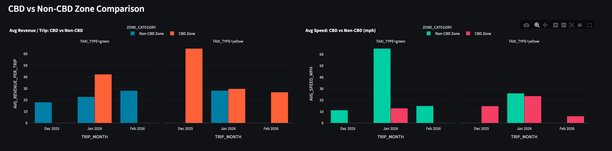

Comparaison directe entre zones CBD et non-CBD :

- **Avg Revenue / Trip: CBD vs Non-CBD** : les courses CBD generent un revenu moyen par course inferieur aux courses non-CBD pour les taxis yellow ($63 vs $29), mais similaire pour les taxis green. Cela s'explique par les distances plus courtes dans le CBD.
- **Avg Speed: CBD vs Non-CBD (mph)** : la vitesse moyenne dans le CBD est nettement inferieure a celle hors CBD, particulierement marquee pour les taxis green. Les taxis yellow maintiennent des vitesses relativement basses dans les deux zones du fait de la densite du trafic manhattanien.

#### Congestion - Yellow vs Green CBD Penetration

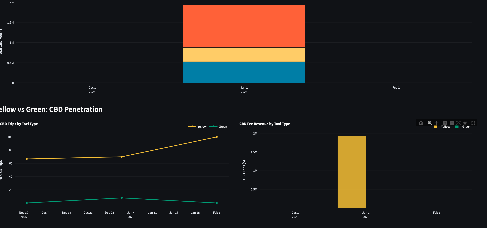

Analyse de la penetration CBD par type de taxi :

- **CBD Trips by Taxi Type** : les taxis yellow representent environ 70% des courses CBD (ligne jaune stable autour de 70-80%), tandis que les taxis green restent marginaux (<10%). Cela reflete la reglementation qui restreint les taxis green principalement aux boroughs exterieurs.
- **CBD Fee Revenue by Taxi Type** : la quasi-totalite des frais CBD ($1.9M) provient des taxis yellow, les taxis green ne contribuant qu'une fraction negligeable.

#### Operations Dashboard

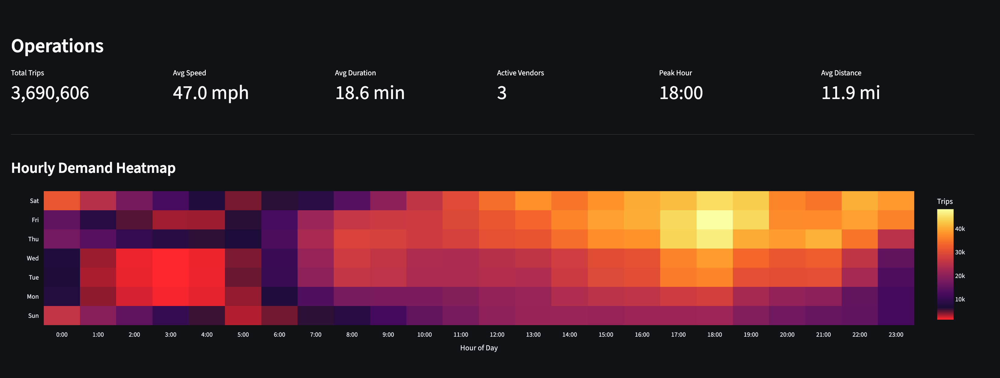

Page operationnelle avec KPIs cles : 3.69M de courses, vitesse moyenne de 47.0 mph, duree moyenne de 18.6 min, 3 vendeurs actifs, heure de pointe a 18h00, et distance moyenne de 11.9 miles.

La **Hourly Demand Heatmap** est une visualisation en carte de chaleur croisant les jours de la semaine (axe Y) et les heures de la journee (axe X). Les couleurs chaudes (jaune/orange) indiquent une forte demande. On observe clairement :
- Les pics de demande en soiree (17h-22h), particulierement le jeudi et vendredi
- Une demande soutenue le samedi en fin de nuit (0h-4h), typique de la vie nocturne
- Le creux de demande en semaine entre 4h et 7h du matin
- Le dimanche comme jour le plus calme

#### Operations - Trip Duration Distribution

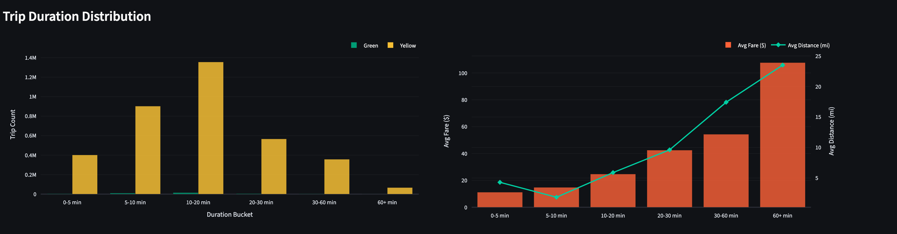

Analyse de la distribution des durees de course :

- **Trip Duration Distribution** : histogramme montrant la repartition des courses par tranche de duree. La tranche 10-20 min domine avec 1.4M de courses, suivie de 5-10 min (900K) et 20-30 min (600K). Les courses de plus de 60 min sont rares (<100K). Les taxis yellow (jaune) dominent largement les taxis green (turquoise) dans toutes les tranches.
- **Avg Fare & Distance by Duration** : correlation entre duree, tarif moyen (barres oranges) et distance moyenne (ligne turquoise). Le tarif augmente de $20 (0-5 min) a $105 (60+ min), tandis que la distance passe de 2 miles a 24 miles. La relation est quasi-lineaire, confirmant la coherence du modele tarifaire.

---

## License

Private project.
