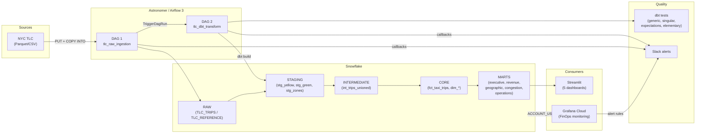
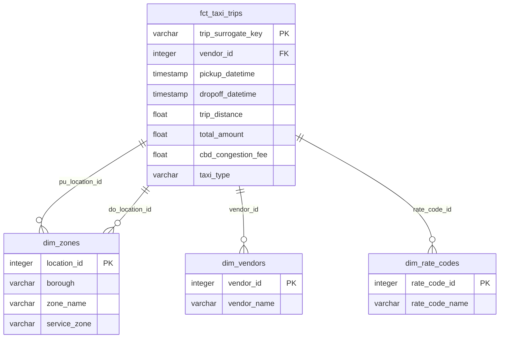

# snow-airflow-dbt

Production-grade ELT pipeline for NYC TLC taxi data analysis: **Snowflake** + **Airflow (Astronomer)** + **dbt** + **Streamlit** + **Grafana FinOps**.

---

## Architecture





---

## Project Structure

```
snow-airflow-dbt/
├── .github/
│   └── workflows/
│       └── ci.yml                     # 3-job CI: SQLFluff lint, dbt build, DAG validation
├── astro-project/                     # Astronomer project (Airflow 3, Runtime 3.1)
│   ├── Dockerfile
│   ├── requirements.txt               # dbt-snowflake, astronomer-cosmos, elementary
│   ├── airflow_settings.yaml          # Snowflake connection config
│   ├── dags/
│   │   ├── tlc_raw_ingestion.py       # DAG 1: download -> PUT -> COPY INTO
│   │   └── tlc_dbt_transform.py       # DAG 2: dbt seed -> build -> elementary
│   └── include/
│       ├── slack_alerts.py            # Slack Block Kit notifications
│       ├── sql/
│       │   ├── copy_into_yellow.sql
│       │   ├── copy_into_green.sql
│       │   └── copy_into_zone_lookup.sql
│       └── dbt_project/
│           ├── dbt_project.yml
│           ├── profiles.yml
│           ├── packages.yml           # dbt_utils, dbt_expectations, elementary, evaluator
│           ├── seeds/                 # rate_codes, payment_types, vendor_lookup
│           ├── snapshots/             # SCD2 on taxi_zone_lookup
│           ├── tests/
│           │   ├── generic/           # test_positive_value
│           │   └── singular/          # assert_no_future_trips, assert_fare_consistent_with_distance
│           └── models/
│               ├── staging/           # 3 models (incremental, delete+insert)
│               ├── intermediate/      # 1 model (ephemeral union)
│               └── marts/
│                   ├── core/          # fct_taxi_trips (incremental), dim_zones, dim_vendors, dim_rate_codes
│                   ├── executive/     # met_executive_summary
│                   ├── revenue/       # 4 models (daily, zone, rate_code, payment)
│                   ├── geographic/    # 4 models (zone ranking, pairs, borough, airport)
│                   ├── congestion/    # 4 models (CBD impact, CBD vs non-CBD, peak, yellow vs green)
│                   └── operations/    # 4 models (hourly demand, duration, speed, vendor)
├── grafana/
│   ├── datasource.json               # Snowflake datasource (ACCOUNT_USAGE)
│   ├── finops-dashboard.json          # 6-panel FinOps dashboard
│   ├── alert-rules.json               # 5 alert rules (credit burn, budget, queries, warehouse)
│   └── deploy.sh                      # Automated provisioning script
├── streamlit_app/
│   ├── app.py                         # Multi-page entry point (st.navigation)
│   ├── requirements.txt
│   ├── utils/snowflake_conn.py        # Cached Snowflake connection
│   ├── .streamlit/config.toml         # Dark theme config
│   └── pages/
│       ├── 1_Executive_Overview.py
│       ├── 2_Revenue_Analysis.py
│       ├── 3_Geographic_Intel.py
│       ├── 4_Congestion_Pricing.py
│       └── 5_Operations.py
├── spec.md                            # Full project specification (11 sections)
└── CHANGELOG.md
```

**25 dbt models** | **3 seeds** | **1 snapshot** | **5 Streamlit pages** | **6 Grafana panels** | **5 alert rules**

---

## Tech Stack

| Layer | Technology | Version |
|---|---|---|
| **Cloud DWH** | Snowflake | Enterprise (AWS) |
| **Orchestration** | Apache Airflow | 3.0.1 (Astro Runtime 3.1) |
| **Transformation** | dbt-core / dbt-snowflake | 1.11.x |
| **Data Quality** | dbt_expectations, Elementary | 0.10.x / 0.23.x |
| **CI/CD** | GitHub Actions | SQLFluff + dbt build + DAG validation |
| **Visualization** | Streamlit + Plotly | 1.41+ / 5.24+ |
| **FinOps Monitoring** | Grafana Cloud | 13.0.0 (Enterprise) |
| **Alerting** | Slack (Block Kit) | Webhook integration |

---

## Prerequisites

- **Docker Desktop** (running)
- **Astro CLI** >= 1.40 (`brew install astro`)
- **Snowflake account** with `ACCOUNTADMIN` role
- **Python** >= 3.11
- **Grafana Cloud** instance with Snowflake plugin installed

---

## Setup

### 1. Clone the repository

```bash
git clone https://github.com/Stefen-Taime/snow-airflow-dbt.git
cd snow-airflow-dbt
```

### 2. Snowflake setup

Connect to your Snowflake account and run the SQL commands from `spec.md` Section 3 to create:
- Databases: `RAW`, `ANALYTICS`
- Schemas: `RAW.TLC_TRIPS`, `RAW.TLC_REFERENCE`
- Warehouse: `TLC_WH` (X-SMALL, auto-suspend 60s)
- Tables, stages, and file formats
- Resource monitor: `tlc_budget_monitor` (100 credits/month)

### 3. Astronomer / Airflow

```bash
cd astro-project

# Configure Snowflake connection in airflow_settings.yaml
# Set SNOWFLAKE_ACCOUNT, SNOWFLAKE_USER, SNOWFLAKE_PASSWORD, etc.

# Start Airflow (5 containers)
astro dev start

# Airflow UI: http://localhost:8080
```

Configure Airflow variables:
- `tlc_base_url`: `https://d37ci6vzurychx.cloudfront.net/trip-data`
- `tlc_data_months`: `["2026-01"]`
- `slack_webhook_url`: your Slack incoming webhook URL

### 4. Run the pipeline

1. Trigger **DAG 1** (`tlc_raw_ingestion`) from the Airflow UI
   - Downloads TLC Parquet/CSV files
   - PUT to Snowflake internal stages
   - COPY INTO raw tables
   - Auto-triggers DAG 2
2. **DAG 2** (`tlc_dbt_transform`) runs automatically:
   - `dbt seed` (reference tables)
   - `dbt build` (staging -> intermediate -> core -> marts)
   - Elementary observability report

### 5. Streamlit dashboards

```bash
cd streamlit_app

# Configure .streamlit/secrets.toml with your Snowflake credentials
pip install -r requirements.txt
streamlit run app.py
# Open http://localhost:8501
```

5 interactive pages: Executive Overview, Revenue Analysis, Geographic Intel, Congestion Pricing, Operations.

### 6. Grafana FinOps monitoring

```bash
cd grafana

export GRAFANA_URL="https://your-instance.grafana.net"
export GRAFANA_TOKEN="glsa_xxxx..."
export SNOWFLAKE_PASSWORD="your_password"

# Install Snowflake plugin first (Connections > Add new connection > Snowflake)
./deploy.sh
```

Deploys:
- Snowflake datasource (ACCOUNT_USAGE views)
- 6-panel FinOps dashboard (credits, budget, warehouses, queries, storage)
- 5 alert rules (credit burn rate, budget thresholds, long queries, idle warehouses)

---

## dbt Models

### Lineage

```
Sources (RAW)
  ├── stg_yellow_taxi_trips  (incremental, delete+insert)
  ├── stg_green_taxi_trips   (incremental, delete+insert)
  └── stg_taxi_zone_lookup   (table)
        │
        v
  int_trips_unioned (ephemeral)
        │
        v
  fct_taxi_trips (incremental, delete+insert, contract enforced)
  dim_zones / dim_vendors / dim_rate_codes (table)
        │
        v
  ┌─────────────┬──────────────┬──────────────┬──────────────┬──────────────┐
  │  executive   │   revenue    │  geographic  │  congestion  │  operations  │
  │  (1 model)   │  (4 models)  │  (4 models)  │  (4 models)  │  (4 models)  │
  └─────────────┴──────────────┴──────────────┴──────────────┴──────────────┘
```

### Data Quality

| Test Type | Count | Details |
|---|---|---|
| **Column tests** | unique, not_null, accepted_values, relationships | Core models fully tested |
| **dbt_expectations** | 3 | Range checks on passenger_count, trip_distance, fare_amount |
| **Elementary** | 2 | volume_anomalies, schema_changes on fct_taxi_trips |
| **Generic** | 1 | test_positive_value (reusable) |
| **Singular** | 2 | assert_no_future_trips, assert_fare_consistent_with_distance |
| **Mart tests** | Column-level | not_null, positive values, accepted_values across all 17 mart models |

---

## CI/CD Pipeline

GitHub Actions workflow (`.github/workflows/ci.yml`) runs on PRs to `main`:

```
┌────────────────┐    ┌──────────────────────┐    ┌───────────────────┐
│  SQLFluff Lint  │───>│  dbt Build & Test    │    │  DAG Validation   │
│  (models/)      │    │  (state:modified+)   │    │  (Python import)  │
└────────────────┘    │  + project_evaluator  │    └───────────────────┘
                      └──────────────────────┘
                                │ failure
                                v
                      ┌──────────────────────┐
                      │  Slack Notification   │
                      └──────────────────────┘
```

---

## Alerting

### Airflow (Slack Block Kit)
- DAG success/failure callbacks with color-coded messages
- Task-level failure notifications with error details
- Channel: configurable via `slack_channel` Airflow variable

### Grafana (Alert Rules)
| Rule | Threshold | Severity |
|---|---|---|
| High Credit Burn Rate | > 20 credits/day | warning |
| Budget 50% Reached | > $200 cumulative | warning |
| Budget 80% Reached | > $320 cumulative | critical |
| Long Running Query | > 5 min execution | warning |
| Warehouse Auto-Suspend | > 10% cloud services ratio | info |

---

## License

Private project.
